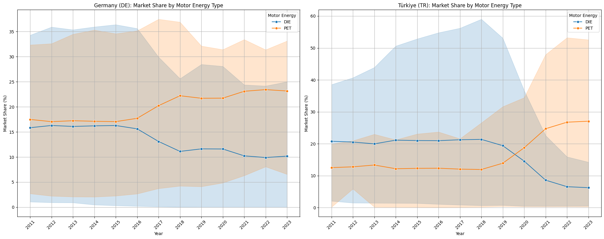
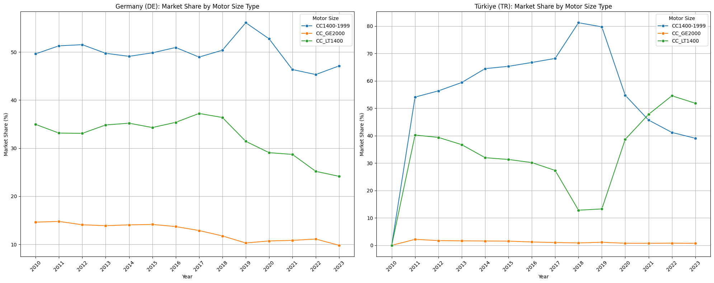
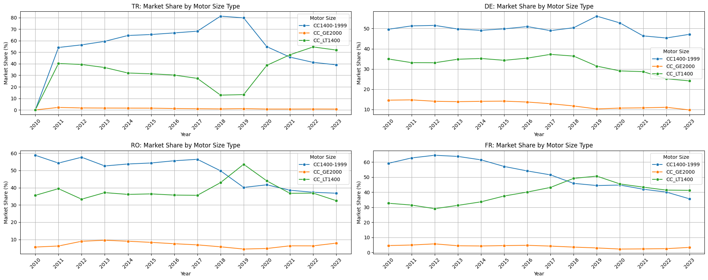
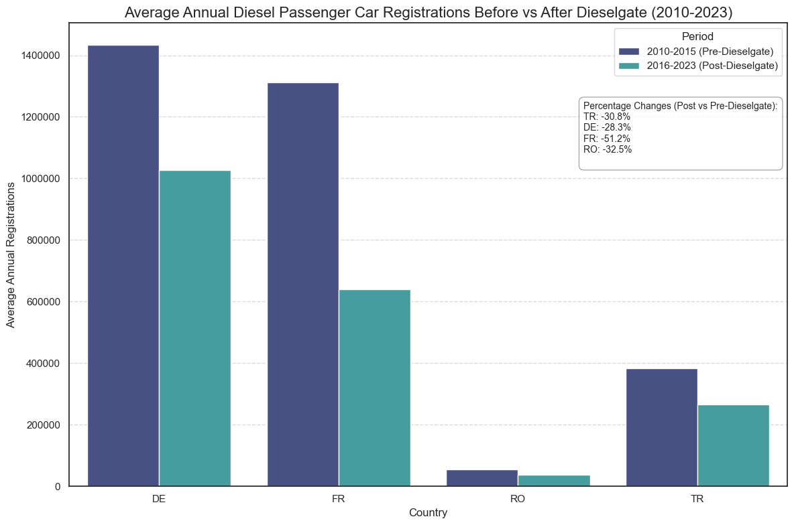

# European Passenger Car Market Analysis

This project analyzes the dynamics of new passenger car registrations in the European Union and Türkiye, using comprehensive data obtained from Eurostat. Our primary goal is to analyze market share trends based on motor energy types (Diesel, Petrol) and engine size classes (below 1.4L, 1.4-2.0L, above 2.0L), and specifically to identify and explain the differences between EU countries and Türkiye.

## Data Source

The dataset used for this analysis is sourced from the European Statistical Office (Eurostat), specifically the "New passenger car registrations by motor energy and size type" data table. The dataset covers the period from 1970 to 2023.

[Eurostat Dataset Link](https://ec.europa.eu/eurostat/databrowser/view/road_eqr_carmot/default/table?lang=en&category=road.road_eqr)

## Technologies Used

* **Python:** The main programming language for data manipulation, analysis, and visualization.
* **Pandas:** For efficient work with dataframes and data manipulation.
* **Matplotlib:** The foundational library for data visualization.
* **Seaborn:** A library built on Matplotlib for more aesthetic and statistical data visualizations.
* **PostgreSQL:** A relational database management system for data storage and querying.
* **psycopg2:** For connecting Python to the PostgreSQL database.
* **Gemini AI:** Utilized for brainstorming ideas during the project.

## Analysis Steps

This project was carried out by following the steps below:

1.  **Data Collection and Database Preparation:**
    * Raw TSV data was downloaded from Eurostat.
    * The dataset was imported into a PostgreSQL database table named `new_car_registrations_long`. In this phase, the database schema was defined, and data types were appropriately set.

2.  **Data Loading with Python and Initial Exploratory Data Analysis (EDA):**
    * A connection to the PostgreSQL database was established via Python using the `psycopg2` library.
    * The data was loaded into a Pandas DataFrame.
    * The dataset was examined using fundamental Pandas functions such as `df.info()`, `df.describe()`, `df.head()`, `df.isnull().sum()`, and `value_counts()` to check column types and missing values.
    * **Challenges and Solutions:** Particularly high volumes of missing values (NaN) in the `registration_count` column and 'data not available' situations represented by ':' from Eurostat were identified. The impact of these situations on visualizations was analyzed.

3.  **Data Cleaning and Transformation:**
    * Unnecessary columns like `freq` and `unit` were removed from the DataFrame.
    * The meaning of 'TOTAL' categories in `mot_nrg` and `engine` columns was thoroughly investigated, and specific filtering strategies were determined to prevent double-counting in market share calculations.

4.  **Market Share Calculations:**
    * **Motor Energy Market Share:** Market shares for diesel and petrol vehicles were calculated for each year and geographical entity. In this calculation, the sum of specific fuel and engine size combinations was used as the denominator for the market.
    * **Motor Size Market Share:** Market shares for different engine sizes (below 1.4L, 1.4-1.99L, above 2.0L) were calculated for each year and geographical entity. In this calculation, the overall market total, represented by `mot_nrg='TOTAL'` and `engine='TOTAL'`, was used as the denominator.
    * **Challenges and Solutions:** A challenge arose in calculating motor size market share due to the Eurostat data structure not directly providing combinations of 'TOTAL' motor energy and specific engine sizes. This necessitated recalculating the registration counts for specific engine sizes by summing across all fuel types (using `groupby`). NaN values resulting from calculations were cleaned.

5.  **Data Visualization:**
    * **Basic Trend Charts:** Total registration trends and absolute registration trends for main motor energy types were plotted using `seaborn.lineplot`.
    * **Market Share Line Charts:** Market share trends for motor energy types and engine sizes were visualized with `seaborn.lineplot`.
    * **Stacked Area Charts:** Stacked area charts were created using `matplotlib.pyplot.stackplot` to show the composition of market shares over time for both motor energy types and engine sizes. During this phase, a transition from `seaborn.histplot` to `matplotlib` was made due to incompatibility, and data was prepared into a suitable format using `pivot_table`.
    * **Country Comparison Charts:** Market share trends for motor energy and motor size for Germany and Türkiye were compared side-by-side within a single figure using `matplotlib.pyplot.subplots`. In this phase, the issue of blank charts due to early-period NaN values in Germany's data was resolved through data filtering and year range limitation.

## Key Findings and Insights

The main findings and insights derived from this analysis are as follows:

* **Diesel and Petrol Vehicle Market Share Dynamics:**
    * A significant decline in the market share of diesel vehicles has been observed in both Germany and Türkiye after a certain period (especially towards the late 2010s). This decline can be associated with global emission regulations and increasing environmental awareness.
    * As diesel market share decreased, petrol vehicle market share relatively maintained its stability or even increased in some periods. This suggests that petrol vehicles played a "bridge" role until electric and hybrid vehicles became fully dominant.

    

* **Country-Specific Differences in Engine Volume Preferences:**
    * In Germany, the market share of vehicles with engine volumes of 2.0 liters and above has historically fluctuated between 10-20%, whereas in Türkiye, this rate has generally remained below 10%, even at 1-2% levels. This situation is directly related to economic factors such as the average purchasing power, tax policies, and fuel costs in each country. Germany's higher purchasing power enables consumers to opt for larger and more powerful vehicles, while in Türkiye, the inclination towards more economical vehicles is more pronounced.

    

* **Türkiye's Specific Engine Volume Trends:**
    * In Türkiye, a continuous increase in the market share of vehicles with engine volumes below 1.4 liters has been observed, particularly after 2018. This increase has surpassed the market share of 1.4-1.99 liter vehicles starting from 2021. This change clearly indicates that economic fluctuations and tax advantages in Türkiye have directed consumers towards smaller, more fuel-efficient, and cost-effective vehicles.

    

* **Four-Country Engine Size Market Share Comparison (2010-2023):**

    * The 1.4L and below engine market share trends in France and Romania followed a similar course. In France, sub-1.4L engines became the market leader towards the end of 2017 and maintained this leadership until 2023, although their market share percentage decreased. In Romania, leadership between sub-1.4L and 1.4-1.99L engines shifted occasionally.

    * In Germany, the sub-1.4L engine market never reached 40%, unlike France, Türkiye, and Romania. Instead, 1.4-1.99L engines maintained a market share dominance of approximately 45-50%. This situation indicates that consumer preferences and market structure in Germany differ from other countries.

    

* **Impact of Dieselgate Scandal on Diesel Passenger Car Registrations (2010-2023):**

    * France: Experienced the sharpest decline in average annual diesel registrations, at -51.2%.

    * Türkiye: Recorded a substantial decrease of -30.8% in average annual diesel registrations.

    * Romania: Showed a -32.5% drop in average annual diesel registrations.

    * Germany: Despite being at the epicenter of the scandal, saw a relatively smaller decrease of -28.3% in average annual diesel registrations compared to others.

    * These findings clearly demonstrate the profound and lasting impact of the scandal and subsequent environmental awareness on consumer preferences and automotive markets across Europe.

    

* **Data Limitations:**
    * The absence of a separate `mot_nrg` category for electric and hybrid vehicles in the analyzed Eurostat dataset prevented a direct examination of this important and rising market segment. This indicates the need for different or more current data sources for future analyses.
    * High volumes of `NaN` (missing data) values in the dataset, especially for earlier years, led to uncertainties in interpreting early period trends.

## Future Enhancements

This project provides a solid foundation for understanding key trends in the passenger car market. In the future, the following enhancements can be made to further deepen the analysis and gain different insights:

* **Integration of Additional Data Sources:** More current and comprehensive datasets detailing electric and hybrid vehicle registrations can be integrated. Furthermore, market data can be combined with macroeconomic indicators such as fuel prices, GDP, and per capita income to conduct more in-depth correlation analyses.
* **Creation of an Interactive Dashboard:** Transforming the findings and visualizations into an interactive dashboard using tools like Tableau or Power BI would allow users to explore the data and strengthen the project's presentation.
* **Vehicle Segmentation Analysis:** If data becomes available, market share trends and customer preferences based on vehicle segments (SUV, sedan, hatchback, etc.) can be examined.
