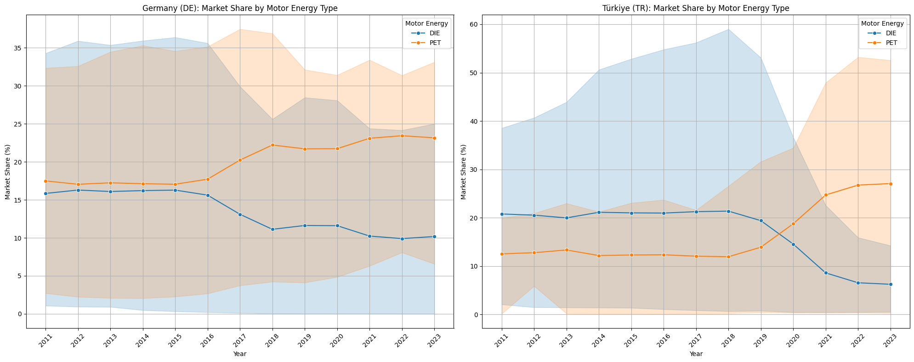
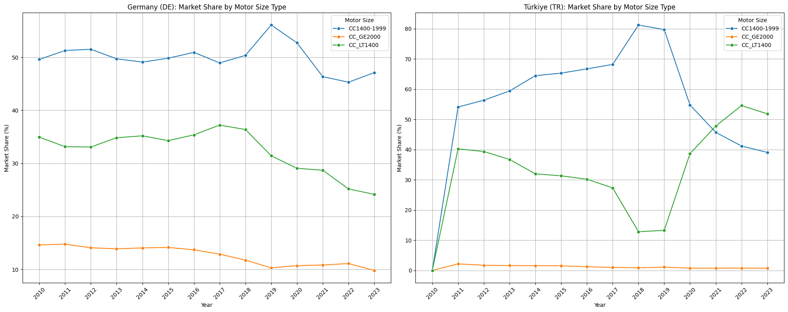

# Avrupa Binek Otomobil Pazar Analizi

Bu proje, Eurostat'tan alınan kapsamlı verileri kullanarak Avrupa Birliği ve Türkiye'deki yeni binek otomobil tescillerinin dinamiklerini inceler. Temel hedefimiz, motor enerji tipleri (Dizel, Benzin) ve motor hacmi sınıfları (1.4L altı, 1.4-2.0L arası, 2.0L üstü) bazında pazar payı trendlerini analiz etmek ve özellikle Almanya ile Türkiye arasındaki farklılıkları ve nedenlerini ortaya koymaktır.

## Veri Kaynağı

Bu analiz için kullanılan veri seti, Avrupa İstatistik Ofisi (Eurostat) tarafından sağlanan "Yeni binek otomobil tescilleri, motor enerji ve boyut tipine göre" veri tablosundan alınmıştır. Veri seti, 1970'ten 2023'e kadar olan dönemi kapsamaktadır.

[Eurostat Veri Seti Linki](https://ec.europa.eu/eurostat/databrowser/view/road_eqr_carmot/default/table?lang=en&category=road.road_eqr)

## Kullanılan Teknolojiler

* **Python:** Veri manipülasyonu, analizi ve görselleştirme için ana programlama dili.
* **Pandas:** Veri çerçeveleriyle etkili çalışma ve veri manipülasyonu için.
* **Matplotlib:** Veri görselleştirme için temel kütüphane.
* **Seaborn:** Daha estetik ve istatistiksel veri görselleştirmeleri için Matplotlib üzerine kurulu kütüphane.
* **PostgreSQL:** Veri depolama ve sorgulama için ilişkisel veritabanı yönetim sistemi.
* **psycopg2:** Python ile PostgreSQL veritabanı bağlantısı için.
* **Gemini AI:** Projeye dair fikir alışverişinde Gemini'dan faydanıldı.

## Analiz Adımları

Bu proje aşağıdaki adımları takip ederek gerçekleştirilmiştir:

1.  **Veri Toplama ve Veritabanı Hazırlığı:**
    * Eurostat'tan ham TSV verisi indirilmiştir.
    * Veri seti, PostgreSQL veritabanında `new_car_registrations_long` adında bir tabloya aktarılmıştır. Bu aşamada, veritabanı şeması tanımlanmış ve veri tipleri uygun şekilde ayarlanmıştır.

2.  **Python ile Veri Yükleme ve İlk Keşifsel Analiz (EDA):**
    * `psycopg2` kütüphanesi kullanılarak PostgreSQL veritabanına Python üzerinden bağlantı kurulmuştur.
    * Veri, Pandas DataFrame'ine çekilmiştir.
    * `df.info()`, `df.describe()`, `df.head()`, `df.isnull().sum()` ve `value_counts()` gibi temel Pandas fonksiyonları kullanılarak veri seti incelenmiş, sütun tipleri ve eksik değerler kontrol edilmiştir.
    * **Zorluklar ve Çözümler:** Özellikle `registration_count` sütunundaki yoğun eksik değerler (NaN) ve Eurostat'ın ':' ile temsil ettiği 'veri mevcut değil' durumları tespit edilmiştir. Bu durumların görselleştirmeleri nasıl etkileyeceği analiz edilmiştir.

3.  **Veri Temizliği ve Dönüşümü:**
    * Analiz için gereksiz olan `freq` ve `unit` gibi sütunlar DataFrame'den çıkarılmıştır.
    * `mot_nrg` ve `engine` sütunlarındaki 'TOTAL' kategorilerinin anlamı derinlemesine incelenmiş ve pazar payı hesaplamalarında çifte sayımı önlemek için özel filtreleme stratejileri belirlenmiştir.

4.  **Pazar Payı Hesaplamaları:**
    * **Motor Enerjisi Pazar Payı:** Her yıl ve coğrafi bölge için dizel ve benzinli araçların pazar payları hesaplanmıştır. Bu hesaplamada, pazarın paydası olarak spesifik yakıt ve motor boyutu kombinasyonlarının toplamı kullanılmıştır.
    * **Motor Boyutu Pazar Payı:** Her yıl ve coğrafi bölge için farklı motor boyutlarının (1.4L altı, 1.4-1.99L, 2.0L üstü) pazar payları hesaplanmıştır. Bu hesaplamada, pazarın paydası olarak `mot_nrg='TOTAL'` ve `engine='TOTAL'` ile temsil edilen genel pazar toplamı kullanılmıştır.
    * **Zorluklar ve Çözümler:** Motor boyutu pazar payı hesaplamasında, Eurostat'ın veri yapısı nedeniyle doğrudan 'TOTAL' motor enerjisi ve spesifik motor boyutu kombinasyonlarının bulunmaması sorunuyla karşılaşılmıştır. Bu durum, spesifik motor boyutlarının tescil sayılarını tüm yakıt tiplerini toplayarak (groupby ile) yeniden hesaplama ihtiyacını doğurmuştur. Hesaplama sonrası oluşan NaN değerler temizlenmiştir.

5.  **Veri Görselleştirme:**
    * **Temel Trend Grafikleri:** `seaborn.lineplot` kullanılarak toplam tescil trendleri ve ana motor enerji tiplerinin mutlak tescil trendleri çizilmiştir.
    * **Pazar Payı Çizgi Grafikleri:** Motor enerjisi tipleri ve motor boyutları için pazar payı trendleri `seaborn.lineplot` ile görselleştirilmiştir.
    * **Yığılmış Alan Grafikleri:** Motor enerji tipleri ve motor boyutları için pazar paylarının zaman içindeki bileşimini göstermek amacıyla `matplotlib.pyplot.stackplot` kullanılarak yığılmış alan grafikleri oluşturulmuştur. Bu aşamada, `seaborn.histplot` ile yaşanan uyumsuzluk nedeniyle `matplotlib`'e geçiş yapılmış ve veriler `pivot_table` ile uygun formata getirilmiştir.
    * **Ülke Karşılaştırmalı Grafikler:** Almanya ve Türkiye'nin motor enerjisi ve motor boyutu pazar payı trendleri, `matplotlib.pyplot.subplots` kullanılarak tek bir figür içinde yan yana karşılaştırılmıştır. Bu aşamada, Almanya verisindeki erken dönem NaN değerleri nedeniyle grafiklerin boş kalması sorunu, veri filtrelemesi ve yıl aralığı sınırlaması ile çözülmüştür.

## Ana Bulgular ve İçgörüler

Bu analizden elde edilen temel bulgular ve içgörüler aşağıdadır:

* **Dizel ve Benzinli Araç Pazar Payı Dinamikleri:**
    * Hem Almanya hem de Türkiye'de dizel araçların pazar payında belirli bir dönemden sonra (özellikle 2010'ların sonlarına doğru) belirgin bir düşüş gözlemlenmiştir. Bu düşüş, küresel emisyon düzenlemeleri ve çevresel farkındalığın artmasıyla ilişkilendirilebilir.
    * Dizel pazar payı düşerken, benzinli araçların pazar payı nispeten istikrarını korumuş veya bazı dönemlerde artış göstermiştir. Bu durum, elektrikli ve hibrit araçların tam anlamıyla baskın gelene kadar benzinli araçların bir "geçiş köprüsü" rolü oynadığını düşündürmektedir.

    

* **Motor Hacmi Tercihlerindeki Ülkesel Farklılıklar:**
    * Almanya'da 2.0 litre ve üzeri motor hacmine sahip araçların pazar payı, tarihsel olarak %10-20 bandında seyrederken, Türkiye'de bu oran genellikle %10'un altında, hatta %1-2 seviyelerinde kalmıştır. Bu durum, ülkelerin ortalama alım gücü, vergi politikaları ve yakıt maliyetleri gibi ekonomik faktörlerle doğrudan ilişkilidir. Almanya'nın daha yüksek alım gücü, tüketicilerin daha büyük ve güçlü araçlara yönelmesini sağlarken, Türkiye'de ekonomik araçlara olan eğilim daha belirgindir.

    

* **Türkiye'ye Özgü Motor Hacmi Trendleri:**
    * Türkiye'de özellikle 2018 yılından sonra 1.4 litre ve altı motor hacmine sahip araçların pazar payında sürekli bir artış gözlemlenmiştir. Bu artış, 2021 yılından itibaren 1.4-1.99 litre motor hacmine sahip araçların pazar payını geride bırakmıştır. Bu değişim, Türkiye'deki ekonomik dalgalanmaların ve vergi avantajlarının tüketicileri daha küçük, yakıt verimli ve maliyet etkin araçlara yönelttiğini açıkça göstermektedir.

    

* **Dört Ülke Motor Boyutu Pazar Payı Karşılaştırması (2010-2023):**
    * Fransa ve Romanya'nın 1.4L altı motor pazar payı trendleri benzer bir seyir izlemiştir. Fransa'da 1.4L altı motorlar 2017 sonlarına doğru pazar lideri haline gelmiş ve 2023'e kadar bu liderliğini korumuştur, ancak pazar payı oranı azalmıştır. Romanya'da ise 1.4L altı ve 1.4-1.99L arası motorlar arasında liderlik zaman zaman yer değiştirmiştir.

    * Almanya'da 1.4L altı motor pazarı, Fransa, Türkiye ve Romanya'nın aksine hiçbir zaman %40'a ulaşmamıştır. Bunun yerine, 1.4-1.99L motorlar yaklaşık %45'lik bir pazar payı hakimiyetini korumuştur. Bu durum, Almanya'daki tüketici tercihlerinin ve pazar yapısının diğer ülkelere göre farklılaştığını göstermektedir.

    

* **Veri Sınırlılıkları:**
    * Analiz edilen Eurostat veri setinde elektrikli ve hibrit araçlar için ayrı bir `mot_nrg` kategorisinin bulunmaması, bu önemli ve yükselen pazar segmentinin doğrudan incelenmesini engellemiştir. Bu durum, gelecekteki analizler için farklı veya daha güncel veri kaynaklarına ihtiyaç duyulduğunu göstermektedir.
    * Veri setindeki özellikle eski yıllara ait yoğun `NaN` (eksik veri) değerleri, erken dönem trendlerin yorumlanmasında belirsizliklere yol açmıştır.

## Gelecek Geliştirmeler

Bu proje, binek otomobil pazarındaki temel trendleri anlamak için sağlam bir temel sunmaktadır. Gelecekte, analizleri daha da derinleştirmek ve farklı içgörüler elde etmek için aşağıdaki geliştirmeler yapılabilir:

* **Ek Veri Kaynaklarının Entegrasyonu:** Elektrikli ve hibrit araç tescillerini ayrıntılı olarak içeren daha güncel ve kapsamlı veri setleri entegre edilebilir. Ayrıca, yakıt fiyatları, GSYİH, araç başına düşen gelir gibi makroekonomik göstergelerle tescil verileri birleştirilerek daha derinlemesine korelasyon analizleri yapılabilir.
* **Etkileşimli Dashboard Oluşturma:** Elde edilen bulguları ve görselleştirmeleri, Tableau, Power BI gibi araçlar kullanarak etkileşimli bir dashboard'a dönüştürmek, kullanıcıların veriyi keşfetmesine olanak tanır ve projenin sunumunu güçlendirir.
* **Araç Segmentasyonu Analizi:** Eğer veri mevcut olursa, araç segmentlerine (SUV, sedan, hatchback vb.) göre pazar payı trendleri ve müşteri tercihleri incelenebilir.